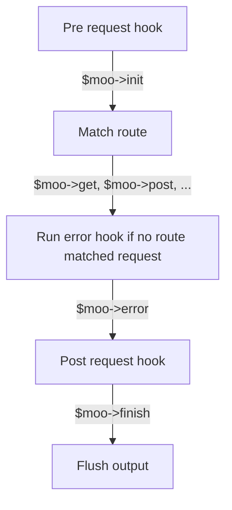

# Moo

Question is not _what_ is Moo, but _why_ is Moo?

There is time that every PHP developer _has to_ create its own framework. Most of them are crap, this one is no exception. 

So, Moo, the framework, is a spawn of PHP evil created for making life and debugging miserable. It took a couple of hours to create, but can take days to find out what and why works or does not. Like most microframeworks, Moo is quite close to HTTP world, made of bunch of pure PHP classes with no external dependencies. Just router, request, response, boom done.

Of course, it would be easier, faster and wiser to just use any other off shelf framework, but there it is, Moo!

## Why _Moo_?
Why not.

## Why use _Moo_?
Seriously, for 99% of time you should not use this framework. Don't do it for sake of your and other developers wellbeing and mental health. 

The only exception to that I can think of, is when you consider using raw .php scripts somewhere on a server. If that is the case, Moo can actually be useful.

Looking for some decent PHP framework? Go learn Symfony, Laravel or anything that actually has any community around. This one does not have any. Actually, you can try writing _your own_ sacred micro framework, just like Moo to learn and validate your PHP skills.

## Installation
If you really have to, here you go, just use composer.
~~~
composer config minimum-stability dev
composer require loskoderos/gpx-php:dev-master
~~~

## Hello World
Simplest Moo application.
~~~php
<?php
$moo = new Moo\Moo();

$moo->get('/', function () {
    return "Hello, this is Moo!";
});

$moo();
~~~

## Usage
This is the sample Moo app with more features presented like state container, plugins and parametrized routing.
~~~php
<?php
$moo = new Moo\Moo();

// Use moo as service container, inject dependency.
$moo->bookService = new App\BookService();

// Override init to set Content-Type header.
$moo->init = function () use ($moo) {
    $moo->response->headers->set('Content-Type', 'application/json');
};

// Override finish to serialize output to JSON.
$moo->finish = function () use ($moo) {
    $moo->response->body = json_encode($moo->response->body);
}

// Custom plugin.
$moo->findBookById = function ($bookId) use ($moo) {
    return $moo->bookService->find($bookId);
}

// Define index handler.
$moo->get('/', function () {
    echo "Hello, this is Moo bookstore!";
});

// Define `GET /books/<id>` handler.
$moo->get('/books/(\d+)', function ($bookId) use ($moo) {
    return $moo->findBookById($bookId);
});

// Run Moo.
$moo();
~~~

## Examples
There are some examples in the `examples` directory.
To run them you can use builtin PHP server.
~~~
php -S 0.0.0.0:8080 examples/hello-world/index.php
~~~

## Documentation
The goal of Moo is simplicity, flexibility and ease of use.

### Concepts
Moo is written in PHP and is closure based. From design perspective it is a front controller, the `Moo\Moo` class exposes a set of standard HTTP methods to bind routing handlers as closures. Additionally, Moo acts as a state container and can be extended with plugins.

All Moo components reside in the PSR-4 `Moo` namespace. The main component is the `Moo\Moo` class. There are three models: `Moo\Request`, `Moo\Response`, `Moo\Route` and the `Moo\Router` that works as dispatcher.

Moo does output buffering, so you can simply output with echo or return a serializable value in the closure.

### Lifecycle
Here is what happends when you call `$moo(...)`:

### Routing
You can bind handlers to standard HTTP methods:
- GET: `$moo->get(...)`
- HEAD: `$moo->head(...)`
- POST: `$moo->post(...)`
- PUT:  `$moo->put(...)`
- DELETE: `$moo->delete(...)`
- CONNECT: `$moo->connect(...)`
- OPTIONS: `$moo->options(...)`
- TRACE: `$moo->trace(...)`
- PATCH: `$moo->patch(...)`

You can match multiple methods using `$moo->route(...)`.

Routes are matched from the first to the last. If no route matches the request, the error handler is called `$moo->error(...)`.

### Parameters
Route can be parametrized with regular expressions.
~~~php
$moo->post('/orders/(\d+)/items/(\d+)', function ($orderId, $itemId) use ($moo) {
    return $moo->orderService->findOrderItem($orderId, $itemId);
});
~~~

### Init & Finish
There are two handlers pre and post request, the init and the finish.
~~~php
$moo->init = function () {
    echo "Hey I'm init";
};
$moo->finish = function () {
    echo "Hey I'm finish";
};
$moo();
~~~

### Error Handling
By default exceptions are handled by the error handlers, that also works when no route matches request.
~~~php
$this->error = function(\Exception $exc) {
    $this->response = new Response([
        'code' => $exc->getCode() > 0 ? $exc->getCode() : 500,
        'message' => StatusCode::message($exc->getCode()),
        'body' => $exc->getMessage()
    ]);
};
~~~

### Request
The `Moo\Request` class consists of:
- method
- uri
- headers
- query
- post
- files
- body

Request object `$moo->request` is created before `init` with the values taken from PHP global variables, `$_SERVER`, `$_GET`, `$_POST`, `$_FILES`.

*Request body is empty by default!*
You can override that with ini:
~~~php
$moo->init = function () ($moo) {
    $moo->request->body = file_get_contents('php://input');
};
~~~

### Response
The `Moo\Response` class consists of:
- body
- headers
- code
- message

Response object `$moo->response` is created before `init` and can be modified during the request lifecycle. Response body is not serialized, it is assumed you serialize it before `flush` in `finish`.

### State
You can use Moo to keep your application state.
~~~php
$moo->something = 123;
$moo->myState = [
    'config' => [
        'host' => 'localhost',
        'port' => 1234
    ]
];
~~~

### Plugins
You can extend Moo with custom functions.
~~~php
$moo->foobar = function () {
    return 123;
};
$moo->foobar();
~~~

### Flush & Output Buffering
By default all output is buffered and then flushed at the end of `$moo()` execution.
You can override that behaviour by setting custom flush handler.
~~~php
$moo->flush = function () use ($moo) {
    header('HTTP/1.1 ' . $moo->response->code . ' ' . $moo->response->message);
    foreach ($moo->response->headers as $name => $value) {
        header($name.': '.$value, true);
    }
    echo $moo->response->body;
};
~~~

## Testing
Moo is unittested, just run `make run`.

## Contributing
Contributions are welcome, please submit a pull request.

## License
MIT
